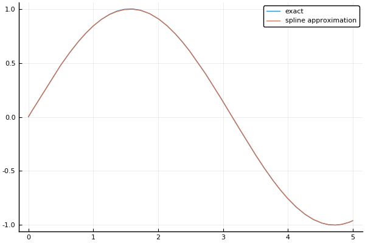
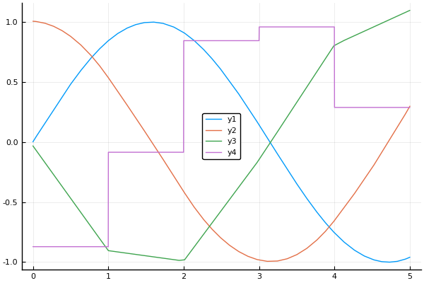

# Plotting 

This package defines plot recipes for use with [Plots.jl](https://github.com/JuliaPlots/Plots.jl).

!!! compat
    Some of the plot recipes require at least RecipesBase 0.6, which requires at least Julia 1.0.

## Plotting a `BSplineBasis`

A B-spline basis can be plotted by passing it to the `Plots.plot` function:

```julia
basis = BSplineBasis(4, 0:5)
plot(basis)
```


By default, each B-spline is drawn with 100 samples.
The number of samples can be changed with an optional argument, i.e., `plot(basis, 5)` will plot each B-spline with only 5 samples.

## Plotting `Spline`s and their derivatives

`Spline`s can be plotted like functions:

```julia
basis = BSpline(4, 0:5)
spl = approximate(sin, basis)
plot(1:5, spl)  # evaluate spl on the points 1:5 and plot it
plot(spl, 1, 3) # plot spl from 1 to 3
plot(spl)       # plot spl from 0 to 5 (its support)
```

To plot a spline together with a `Function`, it needs to be of a `Function` type.
For this purpose, a [`Function`](@ref) constructor is provided that wraps a `Spline` into a `Function` object.

```julia
plot([sin, Function(spl)], 0, 5, label=["exact" "spline approximation"])
```



The `Function` wrapper can also be used to plot the derivatives of a spline via an optional argument:

```julia
f1 = Function(spl)
f2 = Function(spl, Derivative(1))
f3 = Function(spl, Derivative(2))
f4 = Function(spl, Derivative(3))
plot([f1, f2, f3, f4])
```


